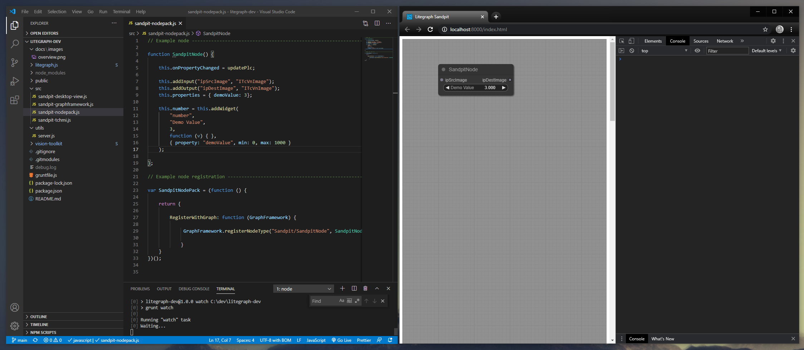

# Litegraph - GraphFramework Dev Toolset
The tool-set is a small sandpit environment to assist with the development of litegraph components.  

It is recommended to install and use vscode as an editor. 


## Getting started

### Prerequisite 
You must have both Git and Node.js installed on your computer.  

### Clone
First clone this repo to your local computer.

### Install
Execute the following command inside the root of the new folder.  Please note, you will need to have a minimum of read access to the vision-toolkit repo before running this command.
```
npm run dev-install
```

### Check it is working
Execute the following command to start the development tools.
```
npm start
```

You can now view the live site by navigating to "http://127.0.0.1:8000/index.html" (this should have already auto-started)

## Developing
You can now modify the javascript files in src and the webpage will automatically rebuild and reload on save.

### sandpit-nodepack.js
This is where you will write your new nodes.  

### sandpit-graphframework.js 
This is where you will overwrite any graph framework functions.

### sandpit-desktop-view.js
This mimics the standard desktop-view javascript in the vision-toolkit project.  You can modify as required.  At the bottom of this file you have space to auto-create nodes on refresh.  In the example this is what auto creates the SandpitNode.  

### sandpit-tchmi
This mimics the standard TcHmi class.  You can add debugging here if required.  Handy for monitoring readEx.

## Update the sub-git repos
Execute the following command.
```
npm run dev-update
```

